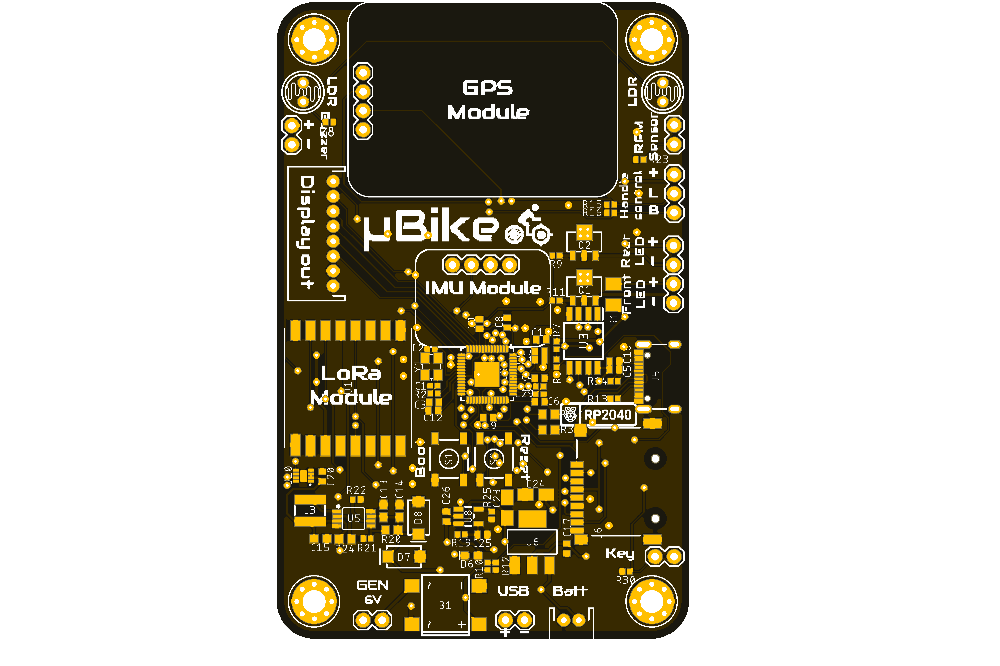
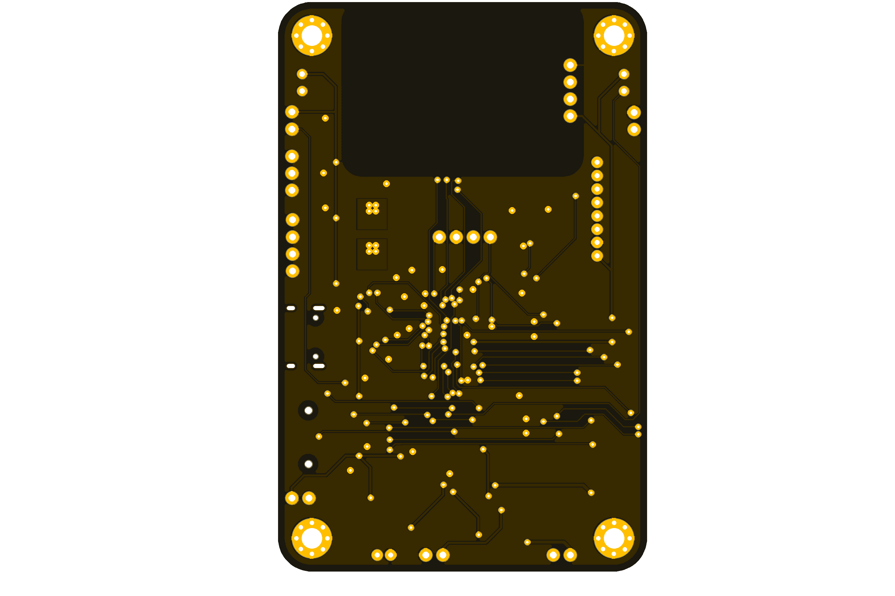

[![GitHub Release][releases-shield]][releases]
[![License][license-shield]](LICENSE)

[![Project Maintenance][maintenance-shield]][maintenance]
[![BuyMeCoffee][buymecoffee-shield]][buymecoffee]

# μBike
RP2040 microcontroller based board for standard bikes applications: lights control, GPS location with LoRa telemetry and display unit.

   
      

## Project tree
---

<li><a href="./uBike/Design/">Design</a></li>
<li><a href="./uBike/Documentation/">Documentation</a></li>

<li><a href="./README.md">README.md</a></li>

## Acknowledgments
---
 * [SparkFun Thing Plus RP2040](https://github.com/sparkfun/SparkFun_Thing_Plus-RP2040) - This board was used as inspiration for the layout design of the μBike

[releases-shield]: https://img.shields.io/github/release/JGAguado/uBike.svg?style=for-the-badge
[releases]: https://github.com/JGAguado/Fuel_Tracker/releases

[license-shield]: https://img.shields.io/badge/License-CC%20BY--NC--SA%204.0-lightgrey.svg?style=for-the-badge

[maintenance-shield]: https://img.shields.io/badge/maintainer-J.%20G.%20Aguado-blue.svg?style=for-the-badge
[maintenance]: https://github.com/JGAguado

[buymecoffee-shield]: https://img.shields.io/badge/buy%20me%20a%20coffee-support-yellow.svg?style=for-the-badge
[buymecoffee]: https://www.buymeacoffee.com/J.G.Aguado